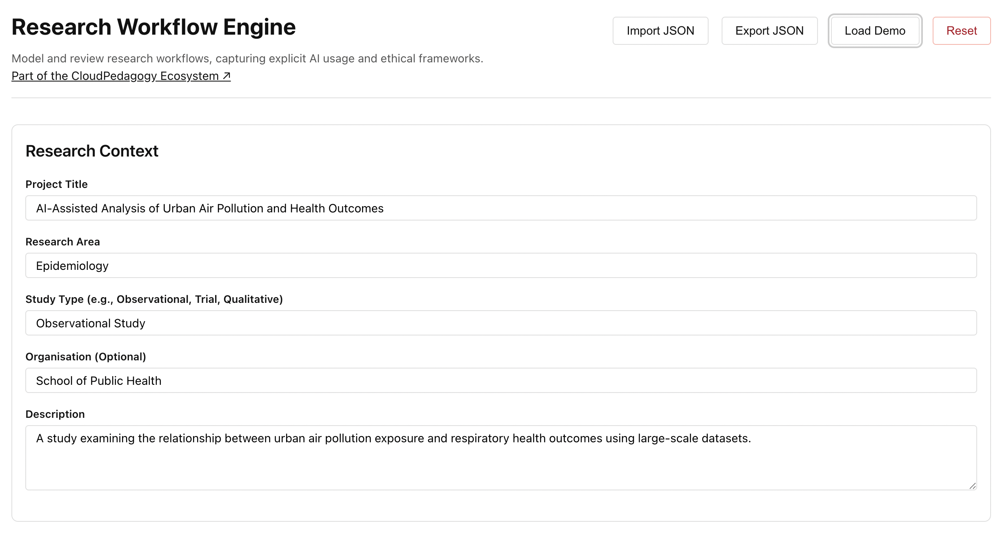

# Research Workflow Engine

A local-first tool for designing, structuring, and governing AI-enabled research workflows across the full research lifecycle.

🌐 **Live Hosted Version**  
http://cloudpedagogy-research-workflow-engine.s3-website.eu-west-2.amazonaws.com/

🖼️ **Screenshot**  

---

## 🔗 Role in the CloudPedagogy Ecosystem

**Phase:** Phase 5 — Practice & Workflow Layer  

**Role:**  
Supports the design and documentation of research workflows, including AI involvement, human oversight, risks, and reproducibility considerations.

**Upstream Inputs:**  
- Research context defined by users  
- Institutional policy and ethical considerations  

**Downstream Outputs:**  
- Structured workflow summaries for governance and review  
- Inputs for the Evidence & QA Pack Generator  
- Documentation for research transparency and reproducibility  

**Does NOT:**  
- Conduct research analysis  
- Automate research execution  
- Replace formal ethics review processes  

---

## Overview

The **Research Workflow Engine** enables researchers and academic teams to design structured, transparent, and governance-aware research workflows in an AI-enabled environment.

It supports:
- mapping research stages from design to dissemination  
- documenting AI involvement at each stage  
- defining human roles and oversight responsibilities  
- capturing risks, ethics, and reproducibility considerations  

This helps ensure research workflows are:
- transparent  
- accountable  
- reproducible  
- aligned with institutional expectations  

---

## Key Features

- **Workflow Stage Design**  
  Define and sequence stages across the research lifecycle  

- **AI Involvement Mapping**  
  Capture how AI is used at each stage  

- **Human Oversight Definition**  
  Specify roles, responsibilities, and decision points  

- **Risk & Ethics Capture**  
  Identify risks, ethical considerations, and constraints  

- **Reproducibility Support**  
  Document methods, assumptions, and reproducibility notes  

---

## Technical Overview

- Built with TypeScript + Vite (React)  
- Fully local-first — runs entirely in the browser  
- Uses localStorage for persistence  
- Supports JSON import/export  
- No backend or external data storage  

---

## Run Locally

npm install  
npm run dev  

---

## Build

npm run build  

---

## Design Principles

- Local-first and inspectable  
- Governance-aware by design  
- Structured, not automated decision-making  
- Supports human judgement rather than replacing it  

---

## Disclaimer

This repository contains exploratory, framework-aligned tools developed for reflection, learning, and discussion.

These tools are provided as-is and are not production systems, audits, or compliance instruments. Outputs are indicative only and should be interpreted using professional judgement.

- All applications run locally in the browser  
- No user data is collected, stored, or transmitted  
- All example data is synthetic and does not represent real institutions or programmes  

---

## About CloudPedagogy

CloudPedagogy develops open, governance-credible tools for building confident, responsible AI capability across education, research, and public service.

- Website: https://www.cloudpedagogy.com/  
- Framework: https://github.com/cloudpedagogy/cloudpedagogy-ai-capability-framework  
